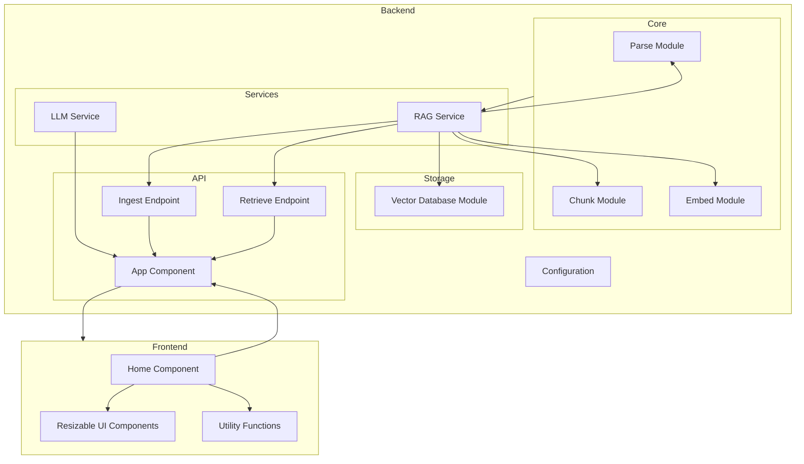

    

    <b>Automatic Architecture Diagrams from Code</b> 
    <a href="https://github.com/swark-io/swark">GitHub</a> • <a href="https://swark.io">Website</a> • <a href="mailto:contact@swark.io">Contact Us</a>

## Usage Instructions

1. **Render the Diagram**: Use the links below to open it in Mermaid Live Editor, or install the [Mermaid Support](https://marketplace.visualstudio.com/items?itemName=bierner.markdown-mermaid) extension.
2. **Recommended Model**: If available for you, use `claude-3.5-sonnet` [language model](vscode://settings/swark.languageModel). It can process more files and generates better diagrams.
3. **Iterate for Best Results**: Language models are non-deterministic. Generate the diagram multiple times and choose the best result.

## Generated Content
**Model**: GPT-4o - [Change Model](vscode://settings/swark.languageModel)  
**Mermaid Live Editor**: [View](https://mermaid.live/view#pako:eNqFVNtuwjAM_ZUoz_ADPEziuiGBhGDsJd1DaE2JaJMqFySG-Pfl0g7SZVqkus45R45ju73hXBSARzjjpaTNCb3PMo7sUuYQgAnNz8CLgEbMVEh4wG5tqFRAvEVrUZgKPmPB9GT4mXibFszrAxTE29-CdBo7LSQte5l8QG7h2YQEB82opgeaSisddLxZxgGXvASlSXihOS8awbjuZb8FLRlcgHTOX8Jx05AFVdoe4_yK5VQzwf-_K8gLy0H1jh2_tgSxbifqHblarTuRdROi6MSp4EdWkvAy8jk7r-sNyUIKrqMAb6IG4owNVTeCQ1QDd3_7JLktKPZFD5WrYuuh_fIhVU_avWaVIs4yfUULw3OXqPqdqZtVNBy-PNUqEI-9p0N_k1TX0yTZzVuS9OOcZPyXkGT8RxSYR-c8Y-sW8HYWI-xn8CLUldoBcZt8d8LN2jr3cF_dHuZj4gGuQdaUFfbPccuwPkENGR6hDBdwpKbSGb5bkWkKqmHGqJ2SGo-0NDDA1Gixu_K820thyhMeHWml4P4NB9Fi2A) | [Edit](https://mermaid.live/edit#pako:eNqFVNtuwjAM_ZUoz_ADPEziuiGBhGDsJd1DaE2JaJMqFySG-Pfl0g7SZVqkus45R45ju73hXBSARzjjpaTNCb3PMo7sUuYQgAnNz8CLgEbMVEh4wG5tqFRAvEVrUZgKPmPB9GT4mXibFszrAxTE29-CdBo7LSQte5l8QG7h2YQEB82opgeaSisddLxZxgGXvASlSXihOS8awbjuZb8FLRlcgHTOX8Jx05AFVdoe4_yK5VQzwf-_K8gLy0H1jh2_tgSxbifqHblarTuRdROi6MSp4EdWkvAy8jk7r-sNyUIKrqMAb6IG4owNVTeCQ1QDd3_7JLktKPZFD5WrYuuh_fIhVU_avWaVIs4yfUULw3OXqPqdqZtVNBy-PNUqEI-9p0N_k1TX0yTZzVuS9OOcZPyXkGT8RxSYR-c8Y-sW8HYWI-xn8CLUldoBcZt8d8LN2jr3cF_dHuZj4gGuQdaUFfbPccuwPkENGR6hDBdwpKbSGb5bkWkKqmHGqJ2SGo-0NDDA1Gixu_K820thyhMeHWml4P4NB9Fi2A)

